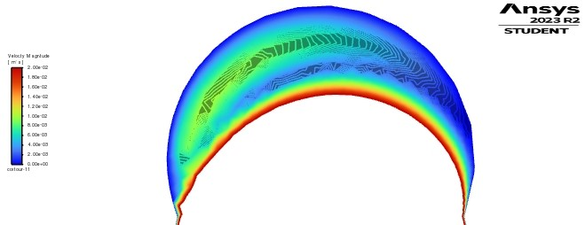
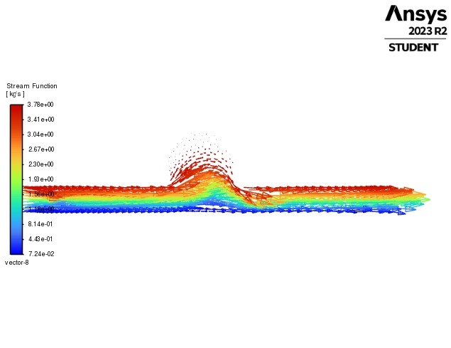

# Computational Analysis Of Cerebral Aneurysm

## Overview
A computational two-dimensional model of an intracranial aneurysm (IA) benchmark geometry was developed to investigate the hemodynamic characteristics associated with aneurysm formation and rupture risk. Wall shear stress (WSS), pressure distribution, velocity fields and flow recirculation within the aneurysmal sac were considered. In an effort to more realistically represent the shear-dependent rheological behavior of blood, a non-Newtonian Carreau viscosity model was adopted. The non-Newtonian rheology is particularly significant for aneurysm simulations as the low shear regions in the aneurysm sacs can lead to markedly different outcomes for the calculated hemodynamic parameters as opposed to the Newtonian assumption.

## My Role
- Developed a two-dimensional computational representation of an intracranial artery and aneurysmal sac based on a standardized IA benchmark geometry
- The Carreau non-Newtonian viscosity model was used to simulate the shear thinning behavior of blood.
- Characterized underlying hemodynamics by analyzing wall shear stress, pressure distribution, velocity profiles and recirculation zones in the aneurysm.
- Numerical results were compared with published literature. Flow characteristics and hemodynamic parameters were compared.

## Technical Stack
- Ansys Fluent
- Ansys Workbench

## Results
- Identified and characterized intra-aneurysmal flow recirculation zones, including regions of reduced velocity and prolonged flow residence.
- Characterized distinct flow–wall interaction regimes within the aneurysmal sac based on local velocity patterns, wall shear stress, and flow impingement.
- Used the computed hemodynamic characteristics to provide insight into flow conditions associated with aneurysm instability and rupture risk, supporting the broader understanding of hemodynamic factors relevant to early risk assessment.

## Images
<table>
  <tr>
    <td align="center">
       
      <b>Recirculation zone in aneurysmal sac </b>
    </td>
    <td align="center">
       
      <b>Stream function vector in an intracranial artery afflicted with a bulge</b>
    </td>
  </tr>

</table>
