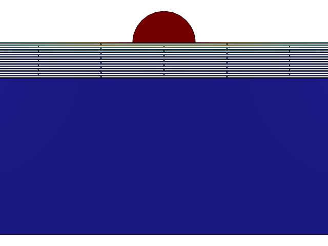
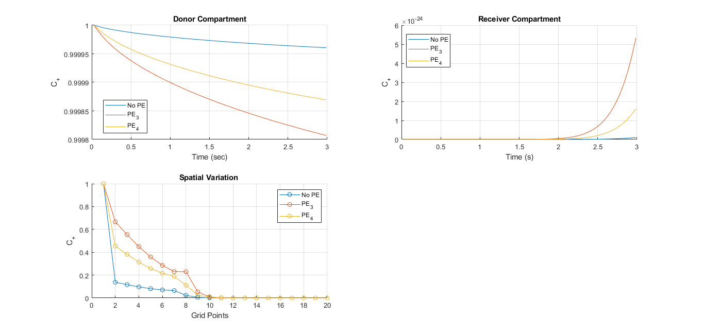
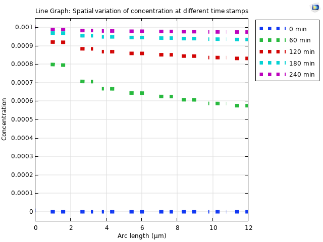

# Numerical Study Of Drug Diffusion through Human Skin

## Overview
The study investigated the feasibility of non-invasive drug delivery through the human skin into the bloodstream. Drug-specific physicochemical properties were incorporated into an in-house MATLAB computational framework based on Fick’s laws of diffusion to evaluate transport characteristics and delivery efficacy.
Additionally, the study also carried out the novel work to computationally model the the Stratum Corneum, the outermost layer of the epidermis and the primary barrier to transdermal transport, to quantitatively characterize its resistance to molecular diffusion.

## My Role
- Extended the computational study to five therapeutically significant pharmaceutical compounds, incorporating their relevant physicochemical and transport properties.
- Investigated transdermal transport enhancement strategies, with particular emphasis on the role of chemical permeation enhancers in modifying skin permeability.
- Developed a computationally representative model of the Stratum Corneum to capture its barrier characteristics and enable visualization and quantitative assessment of its resistance to drug diffusion.
- Investigated the influence of surface wettability and interfacial properties on drug diffusion using the developed computational model.

## Technical Stack
- MATLAB
- COMSOL Multiphysics
- Excel

## Results
- Identified the optimal permeation enhancers, and quantified their multifold increase in diffusion.
- Established surface wettability as a significant parameter influencing drug transport, addressing a factor that has received limited consideration in existing studies.
- Developed a COMSOL Multiphysics model of the Stratum Corneum that enabled improved visualization of diffusion resistance and facilitated systematic manipulation of model parameters.
- Utilized the computational model to investigate the potential effects of skin aging and associated changes in transport properties on transdermal drug diffusion.

## Images
<table>
  <tr>
    <td align="center">
       
      <b>Routes of drug delivery through human skin</b>
    </td>
    <td align="center">
       
      <b>COMSOL model of the stratum corneum with a water droplet on the skin surface, illustrating the computational investigation of surface wettability</b>
    </td>
    
  </tr>
  <tr>
    <td align="center">
       
      <b>Ibuprofen: Comparative study for permeation enhancers- Temporal and spatial variation</b>
    </td>
    <td align="center">
       
      <b>Spatial variation at different time steps</b>
    </td>
  </tr>
</table>
