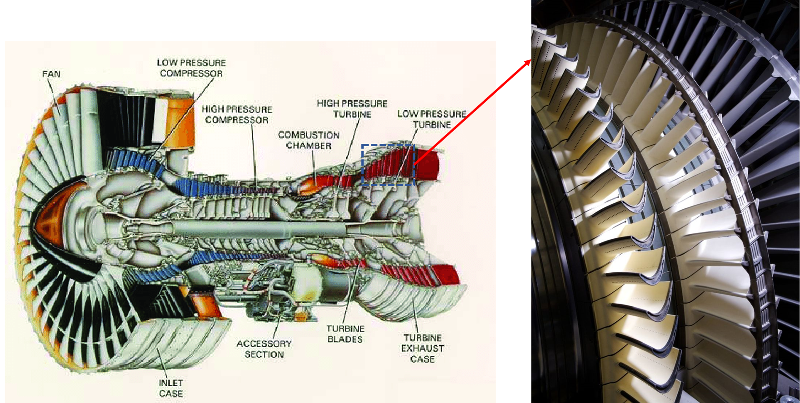
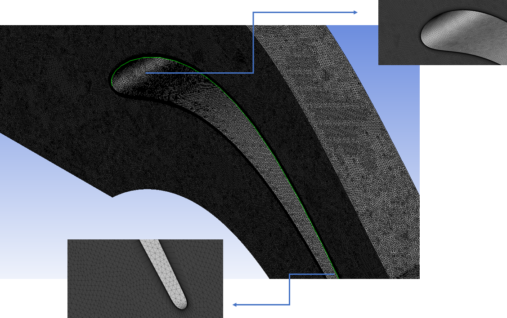
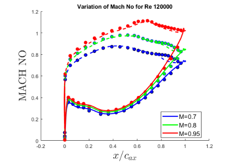
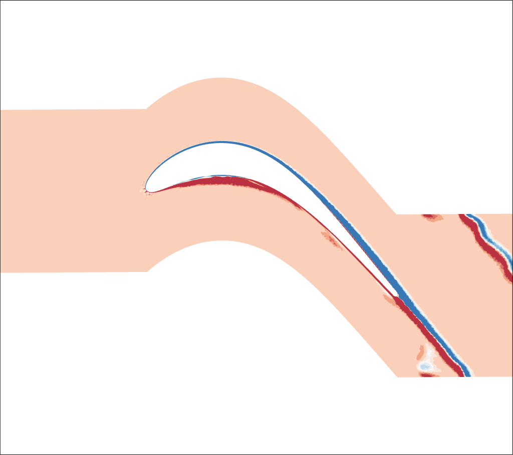
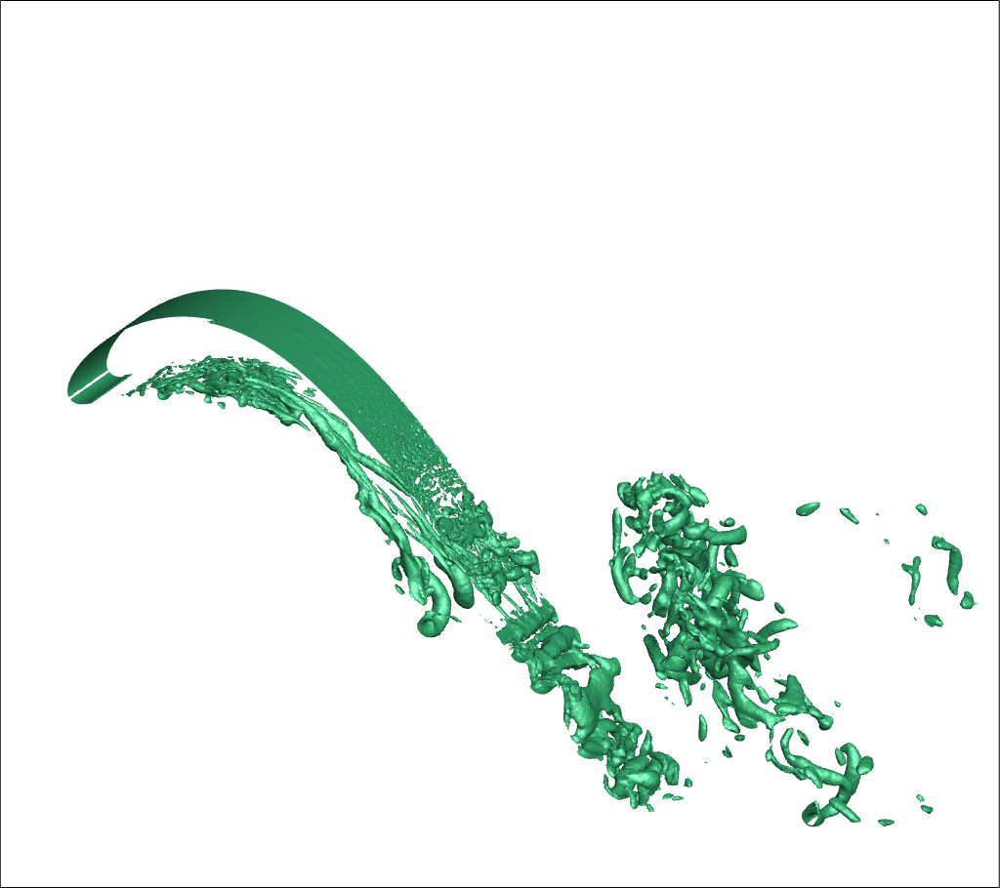

# Flow Separation and Control around a high-speed low-pressure turbine blade
## Motivation and Overview
Due to varying flow conditions around a turbine blade(SPLEEN C1) shock and separation are exhibited in the flow, causing unpreditability and siginificant losses. We performed high fidelity simulations to study flow separation in the transonic regime under varying Mach and Reynolds numbers, employing the transitional SST and LES models in Ansys Fluent.

## My Role
- Developed in-house MATLAB code to calculate pressure distributions and flow characteristics at inlet and outlet using physics-informed equations
- Simulated and analyzed two dimensional RANS models under 6 different conditions, validated against experimental studies.
- Compared performances of solvers to determine optimal methodology.
- Modelled three-dimensional blade to employ Large-Eddy Simulations, utilizing High-Performance Computing Resources
- Utilized TecPlot to post process results

## Tools Used
- ICEM CFD
- Ansys Meshing
- Ansys Fluent
- MALTAB
- Excel
- TecPlot

## Results
- Identified flow separations, reattachments on both suction and pressure sides of blades.
- Encountered shock characteristics as flow approached Mach 1 .
- Analyzed wake regions and vortex characteristics.
- CFD results obtained a good match with the established experimental results.

## Images

