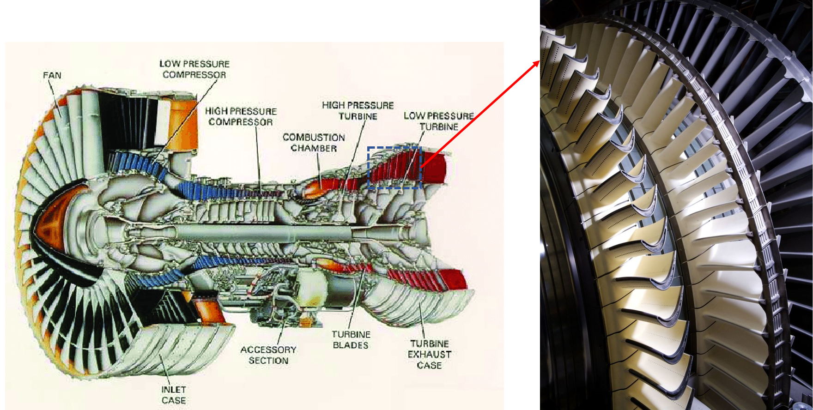
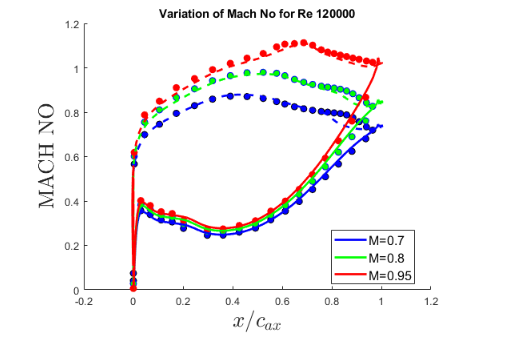
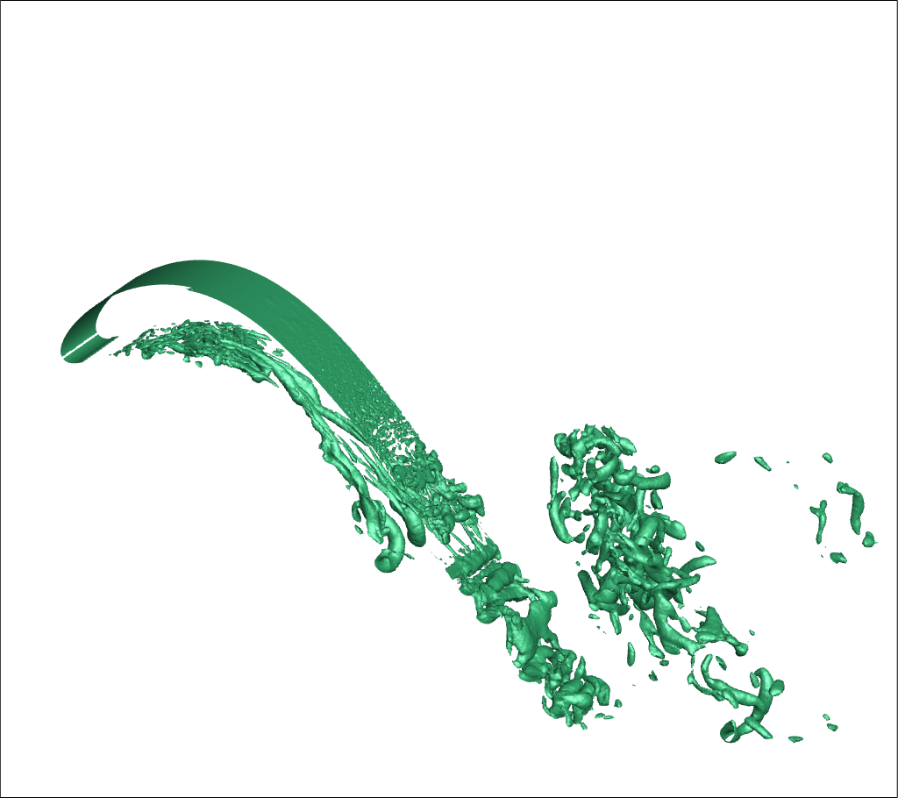

# Flow Separation and Control around a high-speed low-pressure turbine blade
---
*Conducted at the Aeroscience Computations & Analysis lab(ACAL) , IIT Kanpur, under the supervision of Dr. Rajesh Ranjan .*

---

## Motivation and Overview
Due to varying flow conditions around a turbine blade(SPLEEN C1) shock and separation are exhibited in the flow, causing unpreditability and significant losses. We performed high fidelity simulations to study flow separation in the transonic regime under varying Mach and Reynolds numbers, employing the transitional SST and LES models in Ansys Fluent.

## Methodology and Outcome
- Developed an in-house MATLAB solver based on governing flow equations to predict inlet/outlet pressure distributions and flow characteristics.
- Simulated 2D RANS flow across six operating conditions, validating numerical predictions against experimental results to assess model accuracy.
- Compared numerical solver methodologies and identified the approach providing the most reliable flow predictions.
- Built a 3D turbine-blade CFD model and performed LES simulations using High-Performance Computing (HPC) resources to resolve unsteady flow structures.
- Identified flow separation and reattachment on suction and pressure surfaces.
- Encountered shock characteristics as flow approached Mach 1 .
- Analyzed wake regions and vortex characteristics.
- Postprocessed CFD results in TecPlot, visualizing pressure distributions, flow separation, reattachment, vortices and wake development.
- Investigated passive flow control strategies and conducted simulations based on altered geometry with added dimple modification.

## Technical Stack
- ICEM CFD
- Ansys Meshing
- Ansys Fluent
- MALTAB
- Excel
- TecPlot

## Results

## Images
<table>
  <tr>
    <td align="center">
       
      <b>Low Pressure Turbine Blade Cascade</b>
    </td>
    <td align="center">
       
      <b>Three-Dimensional Grid</b>
    </td>
  </tr>
  <tr>
    <td align="center">
       
      <b>Mach Number Distribution validated against Experimental data from VKI</b>
    </td>
    <td align="center">
       
      <b>Q-Criterion Contour (Q = 0.003)</b>
    </td>
  </tr>
</table>
